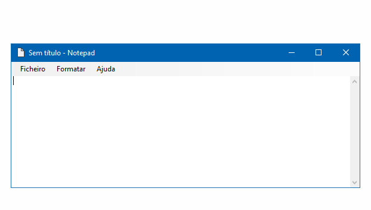
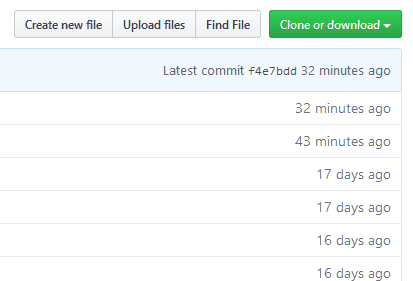

#  NOTEPAD

Clone da aplicação Bloco de Notas do Windows.

## Descrição

**Notepad** é uma aplicação simples, escrita na linguagem C#.

Foi desenvolvida com o intuito de auxiliar na lecionação da linguagem de programação C#.

A acompanhar esta aplicação é fornecido o enunciado de uma ficha de trabalho, em formato DOCX e PDF:
- <a href="Documentos/Ficha de Trabalho Notepad.docx" download>Ficha de trabalho (formato DOCX)</a>
- <a href="Documentos/Ficha de Trabalho Notepad.pdf" download>Ficha de trabalho (formato PDF)</a>

O enunciado contém as instruções necessárias para o desenvolvimento da aplicação, divididas em 4 grupos:
- Grupo 1: funcionalidades básicas
- Grupo 2: about form
- Grupo 3: word wrap e tipo de letra
- Grupo 4: modificações ao texto

O enunciado pode ser modificado de modo a adaptar-se às características da turma, podendo o professor implementar apenas as funcionalidades que desejar.

Neste repositório é disponibilizado o código completo da aplicação **Notepad**, isto é, o resultado final a atingir pelos alunos.

O professor pode modificar o código para:
- implementar apenas algumas funcionalidades
- criar novas funcionalidades
- explorar com os alunos, determinados conteúdos, com maior detalhe

## Como utilizar

Em primeiro lugar, para obter o código:
- se utilizar o <a href="https://git-scm.com/">Git</a>, pode clonar este repositório
- em alternativa, pode efetuar download do repositório em formato ZIP e descompactar no seu computador

Este projeto foi desenvolvido utilizando as versãos 2017 e 2019 do <a href="https://visualstudio.microsoft.com/vs/community/">Visual Studio Community Edition</a>. No entanto deverá compilar sem problemas com versões anteriores do Visual Studio (não testei).

Necessita da <a href="https://www.microsoft.com/pt-pt/download/details.aspx?id=17851">.NET Framework 4.0</a> instalada no computador.

## Licença

MIT
